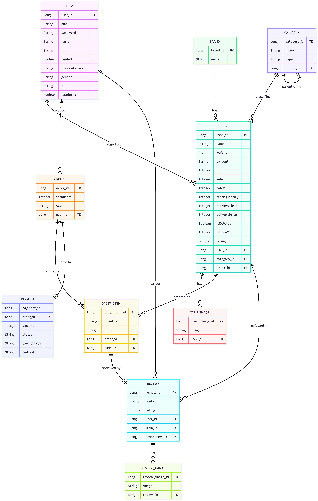

# Coupang Clone Backend

Spring Boot 기반의 쿠팡 이커머스 플랫폼 클론 백엔드 API 서버입니다.

멀티모듈 구조와 헥사고날 아키텍처(Port-Adapter 패턴)를 적용하여 확장성과 유지보수성을 고려한 설계를 구현했습니다.

## Tech Stack

| 분류 | 기술 |
|------|------|
| **Language** | Java 17 |
| **Framework** | Spring Boot 3.2, Spring Security 6, Spring Data JPA, QueryDSL 5.0 |
| **Database** | MySQL, Redis |
| **Payment** | 토스페이먼츠(Toss Payments) 연동 |
| **Cloud** | AWS EC2, AWS S3 |
| **CI/CD** | GitHub Actions |
| **Infra** | Docker Compose |
| **Monitoring** | ELK Stack (Elasticsearch + Kibana), MDC 기반 요청 추적 |
| **Code Quality** | SonarQube, JaCoCo |
| **Documentation** | SpringDoc OpenAPI 3.0 (Swagger) |
| **Testing** | JUnit 5, AssertJ (Spring Boot Test 기반 통합 테스트) |

## Architecture

### Multi-Module Structure

```
coupangclone/
├── api/          # REST 컨트롤러, 필터, 보안 설정, Swagger
├── domain/       # 엔티티, 서비스, 리포지토리, Port 인터페이스
├── common/       # 공통 예외, 응답 DTO, 유틸리티
└── infra/        # Redis Adapter, S3 Adapter, 로깅
```

### Module Dependencies

```
api → common, domain, infra
infra → common, domain
domain → common
common → (standalone)
```

### Hexagonal Architecture (Port-Adapter)

도메인 레이어에서 Port(인터페이스)를 정의하고, 인프라 레이어에서 Adapter로 구현합니다.

```
Domain Layer (Ports)          Infra Layer (Adapters)
─────────────────────         ──────────────────────
JwtPort          ──────────>  JwtProvider
RedisPort        ──────────>  RedisAdapter
S3UploadPort     ──────────>  S3Uploader
PaymentGatewayPort ────────>  TossPaymentClient
```

> 외부 기술(Redis, S3, JWT)이 변경되어도 도메인 로직에 영향을 주지 않습니다.

## ERD



## Key Features

### 1. JWT 이중 토큰 인증/인가

- **Access Token** (15분) + **Refresh Token** (14일) 전략
- Redis 기반 Refresh Token 저장 및 로그아웃 시 토큰 **블랙리스트** 처리
- 만료된 Access Token 자동 갱신 메커니즘
- Spring Security 연동 역할 기반 접근 제어 (USER / ADMIN)

### 2. 상품 관리

- AWS S3 연동 멀티파트 이미지 업로드 (UUID 파일명, 확장자 검증)
- 카테고리 계층 구조 (부모-자식)
- 브랜드 관리

### 3. 상품 검색 & 목록 조회 N+1 개선

- 대소문자 무시 검색 (상품명 + 브랜드명), 정렬 옵션(최신순, 가격 오름차순/내림차순), 페이지네이션
- 검색 로그 기반 **연관 키워드 추천**
- **QueryDSL 서브쿼리 기반 단일 쿼리 조회**: 상품 목록 + 대표이미지 + 리뷰 통계(평균평점/개수)를 상관 서브쿼리로 묶어 한 번에 조회. 상품마다 이미지/리뷰 쿼리를 개별 호출하던 N+1 문제를 해결 (페이지당 최대 32쿼리 → 2쿼리)

### 4. 주문(Order)

- 상품 목록으로 주문 생성 시 재고 차감, 주문 취소 시 재고 복구
- **재고 차감 동시성 제어**: 비관적 락(`SELECT ... FOR UPDATE`)으로 동시 주문 시 재고 초과 판매 방지, 동시 주문 통합 테스트로 검증
- 본인 주문 목록/단건 조회, 소유권 검증
- **주문 목록 조회 N+1 개선**: `Order.orderItems`에 `@BatchSize` 적용, 주문 건수와 무관하게 쿼리 수 고정 (Hibernate Statistics 기반 회귀 테스트로 검증)

### 5. 결제(Payment)

- 토스페이먼츠(Toss Payments) 연동, 결제 승인 요청 검증 후 주문을 결제완료 상태로 전이
- 주문 취소 시 결제 취소 API 호출 (DB 검증/변경이 전부 성공한 뒤 마지막에 외부 PG 호출)

### 6. 리뷰(Review)

- **주문 상품(order-item) 단위** 리뷰 작성 — 재구매 시 주문마다 별도로 리뷰 작성 가능
- 구매 확정(결제완료 이상) 상태의 주문 상품에 한해 작성 가능, 본인 소유권 검증
- 작성/목록조회/요약조회(평균평점·개수)/수정/삭제

## API Documentation

Swagger UI를 통해 API 명세를 확인할 수 있습니다.

```
http://localhost:8080/swagger-ui.html
```

### 주요 API Endpoints

| Method | Endpoint | Description | Auth |
|--------|----------|-------------|------|
| POST | `/api/signup` | 회원가입 | - |
| POST | `/api/login` | 로그인 | - |
| POST | `/api/logout` | 로그아웃 | Bearer |
| GET | `/api/items` | 상품 목록 조회 (페이지네이션, 정렬) | Bearer |
| POST | `/api/items` | 상품 등록 (이미지 업로드) | Bearer |
| GET | `/api/items/search` | 상품 검색 (연관 키워드 포함) | Bearer |
| POST | `/api/orders` | 주문 생성 | Bearer |
| GET | `/api/orders` | 주문 목록 조회 | Bearer |
| GET | `/api/orders/{orderId}` | 주문 단건 조회 | Bearer |
| PATCH | `/api/orders/{orderId}/cancel` | 주문 취소 | Bearer |
| POST | `/api/payments/confirm` | 결제 승인 | Bearer |
| POST | `/api/reviews` | 리뷰 작성 | Bearer |
| GET | `/api/reviews` | 상품 리뷰 목록 조회 | Bearer |
| GET | `/api/reviews/summary` | 상품 리뷰 요약 조회 (평균평점/개수) | Bearer |
| PATCH | `/api/reviews/{reviewId}` | 리뷰 수정 | Bearer |
| DELETE | `/api/reviews/{reviewId}` | 리뷰 삭제 | Bearer |
| POST | `/admin/item/category` | 카테고리 생성 | ADMIN |
| POST | `/admin/item/brand` | 브랜드 생성 | ADMIN |

## Infrastructure

### CI/CD Pipeline (GitHub Actions) — 현재 비활성화

> EC2 인스턴스 중단으로 `.github/workflows/ci-cd.yml`의 파이프라인이 전체 주석 처리되어 있습니다. 아래는 EC2 운영 당시의 배포 구조입니다.

```
Push to main
    │
    ▼
┌─────────────────┐     ┌─────────────────┐
│   Build Stage   │────>│  Deploy Stage   │
│                 │     │                 │
│ - Checkout      │     │ - SSH into EC2  │
│ - JDK 17 Setup  │     │ - Generate      │
│ - Gradle Cache  │     │   secret.yml    │
│ - Build JAR     │     │ - Restart App   │
│ - SCP to EC2    │     │ - Monitor Logs  │
└─────────────────┘     └─────────────────┘
```

- GitHub Secrets로 민감 정보(DB 비밀번호, JWT Secret, S3 키) 관리
- `application-secret.yml`을 배포 시점에 동적 생성

### Docker Compose (개발 환경)

```yaml
# SonarQube  - localhost:9000  (정적 코드 분석)
# Elasticsearch - localhost:9200 (로그 저장)
# Kibana     - localhost:5601  (로그 시각화)
```

### Monitoring & Logging

- **MDC (Mapped Diagnostic Context)**: 요청별 `traceId`, `userId` 부여
- **LoggingInterceptor**: 요청/응답 상세 로깅
- **ELK Stack**: Elasticsearch에 로그 수집, Kibana로 시각화

## Getting Started

### Prerequisites

- Java 17
- MySQL 8.x
- Redis
- (Optional) Docker & Docker Compose

### Run Locally

```bash
# 1. Clone
git clone https://github.com/SongHyeonJin/coupang-clone-backend.git
cd coupang-clone-backend

# 2. MySQL, Redis 실행 후 application-local.yml 설정

# 3. application-secret.yml 생성 (api/src/main/resources/yaml/)
# spring.datasource.password, jwt.secret, cloud.aws.s3.bucket, credentials 설정

# 4. Build & Run
./gradlew :api:clean :api:build -x test
java -jar api/build/libs/api-0.0.1-SNAPSHOT.jar --spring.profiles.active=local
```

### Run Analysis Tools (Docker)

```bash
docker-compose up -d   # SonarQube + ELK Stack
```

## Project Structure

```
coupangclone/
├── api/
│   └── src/main/java/.../
│       ├── controller/         # REST 컨트롤러
│       │   ├── item/           # 상품, 관리자 상품 API
│       │   ├── order/          # 주문 API
│       │   ├── payment/        # 결제 API
│       │   ├── review/         # 리뷰 API
│       │   ├── user/           # 회원 API
│       │   └── devtools/       # 토스페이먼츠 테스트 결제 페이지 (개발용)
│       ├── dto/                # 요청/응답 DTO
│       ├── config/             # Security, Swagger, CORS, Async 설정
│       ├── filter/             # JWT 인증 필터
│       └── advice/             # 응답 헤더 토큰 자동 주입 Advice
│
├── domain/
│   └── src/main/java/.../
│       ├── entity/             # JPA 엔티티
│       │   ├── user/           # User
│       │   ├── item/           # Item, Category, Brand, ItemImage, SearchLog
│       │   ├── order/          # Order, OrderItem
│       │   ├── payment/        # Payment
│       │   └── review/         # Review, ReviewImage
│       ├── service/            # 비즈니스 로직 (item, order, payment, review, user)
│       ├── repository/         # Spring Data JPA 리포지토리 + QueryDSL 커스텀 리포지토리
│       ├── result/             # 계층 간 전달용 Result 객체
│       ├── util/               # 엔티티 → Result 매퍼
│       ├── config/             # JPA Auditing, QueryDSL(JPAQueryFactory) 설정
│       └── auth/               # Port 인터페이스 (JwtPort, RedisPort, S3UploadPort, PaymentGatewayPort)
│
├── common/
│   └── src/main/java/.../
│       ├── exception/          # 커스텀 예외, ExceptionEnum
│       ├── dto/                # 공통 응답 DTO (BasicResponseDto, ErrorResponseDto)
│       └── util/               # TokenHolder (ThreadLocal)
│
├── infra/
│   └── src/main/java/.../
│       ├── adapter/            # Port 구현체 (RedisAdapter, S3Uploader)
│       ├── toss/               # PaymentGatewayPort 구현체 (TossPaymentClient), 설정
│       ├── config/             # Redis, S3 설정
│       └── logging/            # LoggingInterceptor, MDC 설정
│
├── .github/workflows/ci-cd.yml
├── docker-compose.yml
└── build.gradle
```

## Design Decisions

| 결정 | 이유 |
|------|------|
| **멀티모듈 구조** | 모듈 간 의존성 방향 제어, 빌드 단위 분리 |
| **Port-Adapter 패턴** | 도메인 로직의 외부 기술 독립성 확보 |
| **Command/Result 패턴** | 계층 간 결합도 최소화, 엔티티 직접 노출 방지 |
| **이중 토큰 + Redis** | 보안(짧은 Access Token)과 UX(자동 갱신) 동시 확보 |
| **ThreadLocal TokenHolder** | 필터 → Advice 간 토큰 전달, 응답 헤더 자동 주입 |
| **REQUIRES_NEW 전파** | 검색 로그 저장 실패가 메인 트랜잭션에 영향 없도록 분리 |
| **프로파일 분리** | local / test / prod 환경별 독립 설정 |
| **재고 차감 비관적 락** | 동시 주문 시 재고 초과 판매(오버셀) 방지, 낙관적 락 대비 재시도 로직 없이 단순하게 정합성 보장 |
| **주문 취소 후 PG 호출** | 외부 PG(토스페이먼츠) 취소 호출을 DB 검증/변경이 전부 성공한 뒤 마지막에 실행해, 커밋 직전 실패로 "결제는 취소됐는데 DB엔 반영 안 됨" 남는 창을 최소화 |
| **리뷰를 주문 상품 단위로 설계** | 유저+상품 단위 대신 order-item 단위로 설계해 재구매 시에도 구매마다 별도 리뷰 작성 가능하게 함 |
| **목록 조회에 QueryDSL 도입** | JPQL 파생 쿼리로는 표현하기 어려운 상관 서브쿼리(대표이미지 1장, 리뷰 평균/개수)를 단일 쿼리로 묶어 N+1 제거. 컬렉션 연관관계(주문-주문상품)는 `@BatchSize`로 더 간단하게 해결 |
